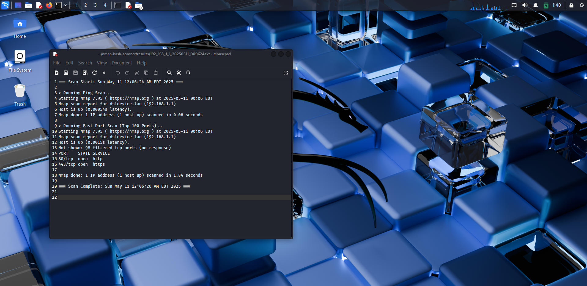

# Automated Network Reconnaissance using Nmap and Bash

**Author:** Lukesh Gulab Navghare
**College/Batch:** G.H Raisoni Collage of Engineering and Management, Nagpur
**Submission Date:** 11/05/2025

---

## 🔍 Overview

This mini-project simplifies one of the foundational tasks in cybersecurity: network reconnaissance. It leverages the power of **Nmap** integrated with a **Bash script** to automate basic scans on a target system or domain. The tool is designed to assist beginners in understanding practical network scanning operations with real-time output and logging.

---

## 🎯 Objectives

- Understand and utilize basic Nmap functions such as Ping Scans, Port Scans, and OS Detection.
- Learn to automate reconnaissance using Bash scripting.
- Build a reusable command-line script that stores scan outputs for documentation and analysis and documentation.

---

## 🛠️ Tools & Technologies

- **Nmap** – Network scanning tool
- **Bash (Linux)** – Scripting language used for automation
- **Kali Linux** – Operating system used for testing
- **GitHub** – For version control and open-source sharing.

---

## 📁 Folder Structure
├── README.md
├── scan.sh
├── results/
│   └── targetname_scan.txt
└── LICENSE
# MIT Lience file

---

## ⚙️ Installation

### 1. Clone the Repository

```bash
git clone https://github.com/lukesh85/automated-nmap-bash.git
cd automated-nmap-bash
2. Install Nmap (if not already installed)
bash
Copy code
sudo apt update
sudo apt install nmap
3. Make the Bash script executable
bash
Copy code
chmod +x scan.sh
🚀 Usage
Run the script using the following syntax:

bash
Copy code
./scan.sh <target> <output_file_path>
🔸 Example Usage
bash
Copy code
# Scan a specific IP and save results
./scan.sh 192.168.1.10 results/192.168.1.10_scan.txt

# Scan a domain
./scan.sh example.com results/example.com_scan.txt
## 🖼️ Screenshots

### Running the Script


### Output File Example


Action	Screenshot
Running the Script	
Host Discovery	
Open Ports Detection	
OS Detection	
Output File Preview	

📝 License
This project is licensed under the MIT License. See the LICENSE file for details.

vbnet
Copy code
MIT License

Copyright (c) 2025 lukesh85

Permission is hereby granted, free of charge, to any person obtaining a copy
of this software and associated documentation files (the "Software"), to deal
in the Software without restriction, including without limitation the rights
to use, copy, modify, merge, publish, distribute, sublicense, and/or sell
copies of the Software, and to permit persons to whom the Software is
furnished to do so, subject to the following conditions:

[... full MIT license text ...]
📬 Contact
For queries or feedback:
📧 lukesh85@proton.me
🔗 GitHub Profile

---

### ✅ Summary of Improvements:
- Proper Markdown headings and styling.
- Corrected spelling (`License`, `College`, `Bash`, etc.)
- Folder tree with inline comments.
- Ready-made placeholders for screenshots.
- Example commands wrapped in `bash` blocks for clarity.
- Optional contact footer (professional touch).

Would you like me to upload this cleaned version directly as your `README.md` file content or help you with screenshot filename formatting before upload?

