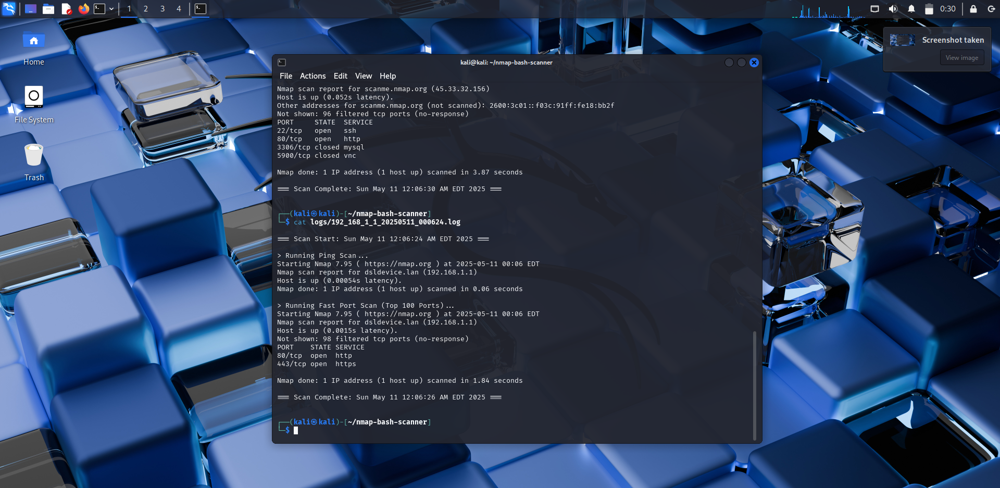
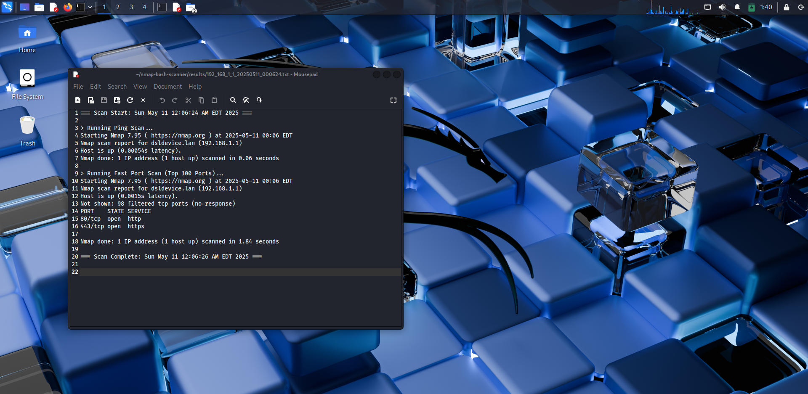

# Automated Network Reconnaissance using Nmap and Bash

**Author:** Lukesh Gulab Navghare
**College/Batch:** G.H Raisoni Collage Of Engineering And Management Nagpur
**Submission Date:** 11/05/2025

---

## 🔍 Overview

This mini-project simplifies one of the foundational tasks in cybersecurity: network reconnaissance. It leverages the power of **Nmap** integrated with a **Bash script** to automate basic scans on a target system or domain. The tool is designed to assist beginners in understanding practical network scanning operations.

---

## 🎯 Objectives

- Understand and utilize basic Nmap functions such as Ping Scans, Port Scans, and OS Detection.
- Learn to automate reconnaissance using Bash scripting.
- Build a reusable command-line script that stores scan outputs for documentation and analysis.

---

## 🛠️ Tools & Technologies

- **Nmap** – Network scanning tool
- **Bash (Linux)** – Scripting language used for automation
- **Kali Linux** – Operating system used for testing
- **GitHub** – For version control and open-source sharing (optional)

---

## 📁 Folder Structure
├── README.md
├── scan.sh
├── results/
│   └── targetname_scan.txt
└── LICENSE
[**Consider adding a brief explanation of each file/folder if needed.** For example:

-   `README.md`: This file, providing an overview of the project.
-   `scan.sh`: The Bash script responsible for running Nmap scans.
-   `results/`: Directory where scan output files are saved.
-   `LICENSE`: Contains the licensing information for the project. ]

---

## ⚙️ Installation

[**Provide instructions on how to get the script running.** This might involve:]

1.  **Cloning the repository (if you're using GitHub):**
    ```bash
    git clone [Your Repository URL]
    cd [Repository Name]
    ```
    [**Replace `[Your Repository URL]` and `[Repository Name]` with your actual repository details if you are using GitHub.**]
2.  **Ensuring Nmap is installed:**
    ```bash
    sudo apt update
    sudo apt install nmap
    ```
3.  **Making the Bash script executable:**
    ```bash
    chmod +x scan.sh
    ```
    [**Note that I've changed `script/network_scanner.sh` to `scan.sh` to match your folder structure.**]

[**Adjust these steps based on your actual setup and requirements.**]

---

## 🚀 Usage

[... your existing usage instructions ...]

### Example of Running the Script

Here's a screenshot showing how to execute the `scan.sh` script:



### Sample Scan Output

This screenshot shows an example of the output generated by the script:



**Example Usage:**

```bash
# Scanning a specific IP address and saving output
./scan.sh 192.168.1.10 results/192.168.1.10_scan.txt

# Scanning a domain
./scan.sh example.com results/example.com_scan.txt
 ""**License**""
MIT License

Copyright (c) 2025 lukesh85

Permission is hereby granted, free of charge, to any person obtaining a copy
of this software and associated documentation files (the "Software"), to deal
in the Software without restriction, including without limitation the rights
to use, copy, modify, merge, publish, distribute, sublicense, and/or sell
copies of the Software, and to permit persons to whom the Software is
furnished to do so, subject to the following conditions:

The above copyright notice and this permission notice shall be included in all
copies or substantial portions of the Software.

THE SOFTWARE IS PROVIDED "AS IS", WITHOUT WARRANTY OF ANY KIND, EXPRESS OR
IMPLIED, INCLUDING BUT NOT LIMITED TO THE WARRANTIES OF MERCHANTABILITY,
FITNESS FOR A PARTICULAR PURPOSE AND NONINFRINGEMENT. IN NO EVENT SHALL THE
AUTHORS OR COPYRIGHT HOLDERS BE LIABLE FOR ANY CLAIM, DAMAGES OR OTHER
LIABILITY, WHETHER IN AN ACTION OF CONTRACT, TORT OR OTHERWISE, ARISING FROM,
OUT OF OR IN CONNECTION WITH THE SOFTWARE OR THE USE OR OTHER DEALINGS IN THE
SOFTWARE.
